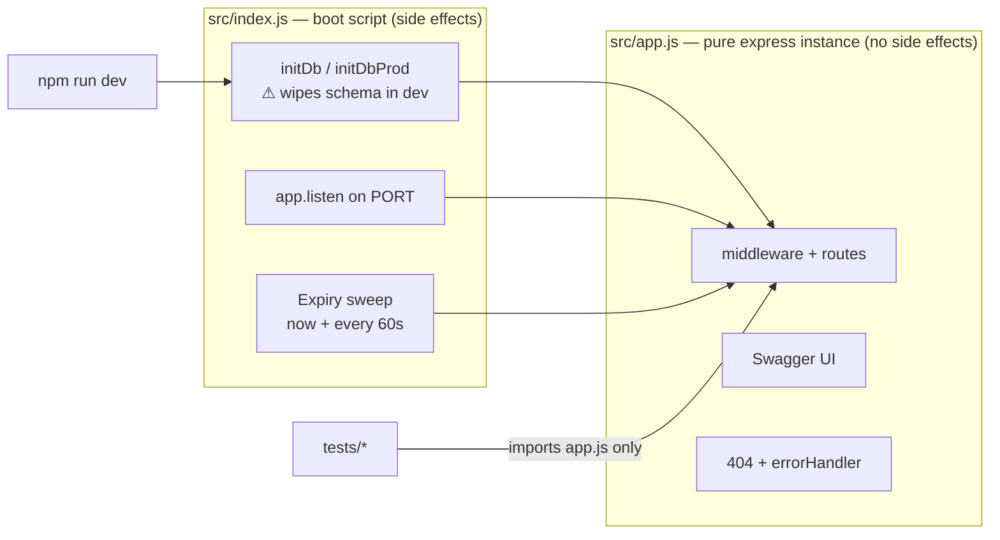
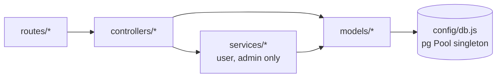
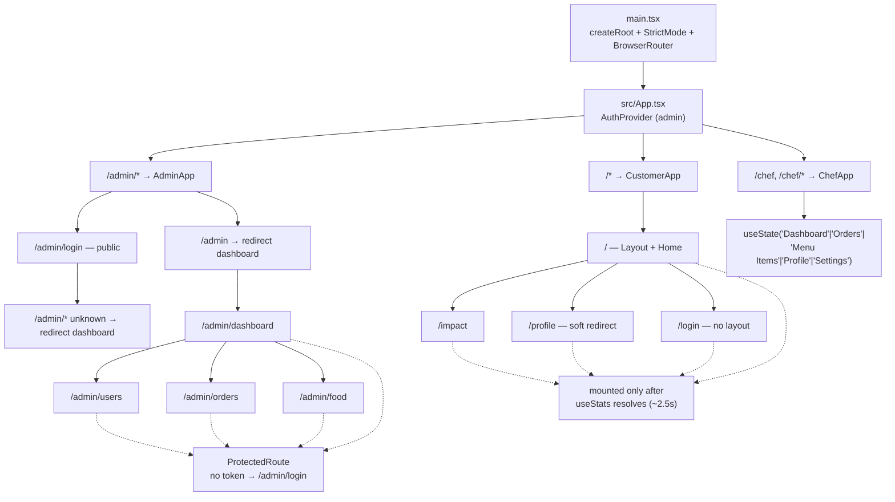

# Kitchen Foods — Developer Guide

> **Orientation for new developers.** This document assumes you have never seen this
> repository before. It walks through what the system is, how to get it running on your
> machine, how each half of the codebase is organised, and how the project is tested and
> deployed. The final section is an honest register of things that are currently broken,
> unsafe, or unfinished — read it so you are not misled by the rest of the guide.
>
> Production deployment: <https://e23-co2060-kitchen-foods-platform-production.up.railway.app>

---

## Table of contents

| Section | What you will find |
|---|---|
| [1. Architecture at a glance](#1-architecture-at-a-glance) | The system diagram and repository map |
| [2. Prerequisites and setup](#2-prerequisites-and-setup) | Getting a working local environment |
| [3. Environment variables](#3-environment-variables) | Every config value, per workspace |
| [4. Backend guide](#4-backend-guide) | Express API, routes, auth, database, conventions |
| [5. Frontend guide](#5-frontend-guide) | React SPA, routing, state, API clients, conventions |
| [6. Testing](#6-testing) | The three test layers and how CI runs them |
| [7. Common tasks](#7-common-tasks) | Recipes for the changes you will actually make |
| [8. Deployment](#8-deployment) | Docker, nginx, Railway |
| [9. Known limitations](#9-known-limitations) | What is unsafe, broken, or unfinished today |
| [Appendix A. File trees](#appendix-a-file-trees) | Complete `src/` listings |
| [Appendix B. Glossary](#appendix-b-glossary) | Domain terms used throughout |

---

## 1. Architecture at a glance

### 1.1 What the product does

Kitchen Foods is a hyper-local food platform. It connects verified home chefs with
customers — tourists, office workers, and nearby residents in Sri Lanka — who want
authentic homemade meals. The differentiating mechanic is a **reverse auction**: a
customer posts a meal request with a budget and a fulfilment window, every approved
chef can bid their own price, and the customer picks a bid. The winning chef then
prepares the order through a status pipeline.

### 1.2 System diagram

```mermaid
graph TB
    subgraph Browser
        UI["React 19 SPA<br/>(Vite dev server :5173)"]
    end

    subgraph Backend["Express 5 API (:8000)"]
        MW["app.js middleware<br/>json · cors · static · 404 · errorHandler"]
        RT["7 route modules<br/>/api/auth · users · admin<br/>food · orders · quotes · upload"]
        MW --> RT
    end

    subgraph Data["Persistence"]
        PG[("PostgreSQL 16<br/>pg Pool · 8 tables")]
        UP[("uploads/ volume<br/>image files")]
    end

    UI -->|"fetch/axios"||"Vite proxy in dev<br/>nginx in prod"| RT
    RT --> MW
    RT --> PG
    RT --> UP
    UI -->|"GET /uploads/*"| MW

    CI["GitHub Actions CI<br/>typecheck · 3 test suites"] -.-> UI
    CI -.-> RT
```

### 1.3 Repository layout

| Path | Contents |
|---|---|
| `backend/` | Express 5 API in plain JavaScript (ESM). No build step. |
| `backend/src/` | Application code — routes, controllers, services, models, middleware, config. |
| `backend/database/` | `01_schema.sql` (DDL) and `02_seed.sql` (demo data). Applied at boot, no migration tool. |
| `backend/tests/` | Vitest unit tests and Postgres integration tests. |
| `backend/docs/` | `openapi.json` + `API_REFERENCE.md`. Served by Swagger UI at `/api-docs`. |
| `frontend/` | The single React SPA containing all three role experiences. |
| `frontend/src/customer/` | Public customer site, admin-free, `/`. |
| `frontend/src/admin/` | Super-admin dashboard, `/admin`. |
| `frontend/src/chef/` | Chef dashboard, `/chef`. |
| `frontend/src/shared/` | Code genuinely used by more than one section. |
| `frontend/tests/e2e/` | Playwright smoke tests. |
| `docs/` | This guide plus the GitHub Pages project site. |
| `docker-compose.yml` | Postgres + backend + frontend + a one-shot `seed` runner. |
| `up.sh` | Convenience script: starts Postgres, runs the seed scripts. |
| `.github/workflows/ci.yml` | Two CI jobs: `frontend` and `backend`. |
| `code/` | Empty placeholder (`put-your-code-here.txt`). Not part of the build. |
| `graphify-out/` | Generated code-knowledge-graph artefacts. Tooling output, not source. |

### 1.4 The one fact that trips up every new developer

This started as **three separate frontends** — customer, admin, and chef — and they have
been **merged into one React application** at `frontend/`. There is a single
`index.html` and a single entry point, `frontend/src/main.tsx`. Routing is split in
`frontend/src/App.tsx`:

| URL prefix | Section | Router lives in |
|---|---|---|
| `/admin/*` | Super-admin dashboard | `src/admin/App.tsx` |
| `/chef`, `/chef/*` | Chef dashboard | *none — see [5.4](#54-the-chef-section-has-no-router)* |
| `/*` (everything else) | Public customer site | `src/customer/App.tsx` |

A single `<AuthProvider>` from the **admin** section wraps the entire tree in
`src/App.tsx`, even though only admin consumes it. When you grep for a component, check
all three sections — code is duplicated across them rather than shared.

---

## 2. Prerequisites and setup

### 2.1 What you need installed

| Tool | Version | Why | Notes |
|---|---|---|---|
| Node.js | 20 or newer | Both workspaces | CI and the Dockerfiles pin **20**; local development on 24.x works. There is no `engines` field, so nothing enforces this. |
| npm | ships with Node | Both workspaces | Both workspaces use `package-lock.json` (lockfile v3), so `npm ci` is the reproducible install. |
| Docker + Compose | any recent | PostgreSQL | Only the database needs Docker in the recommended setup. |

No global CLI tools are required. Playwright installs its own browser on first E2E run.

### 2.2 Ports

| Port | Service | Where it is set |
|---|---|---|
| `5173` | Vite dev server | Vite default; not overridden |
| `8000` | Express API | `process.env.PORT \|\| 8000` in `backend/src/index.js:25` |
| **`5433`** | PostgreSQL **host** port | `docker-compose.yml:13` maps `${DB_PORT:-5433}:5432` |
| `80` | nginx (frontend container only) | `docker-compose.yml:52` |

> **Postgres is on 5433, not 5432.** The container listens on the standard 5432
> internally, but Compose publishes it on host port **5433** to avoid colliding with a
> Postgres you may already run locally. The backend's own default is 5432
> (`backend/src/config/db.js:30`) while the *test* helpers default to 5433
> (`backend/tests/setup/env.js`) — so you will need `DB_PORT=5433` in your `.env`.

### 2.3 Setup path A — hybrid (recommended)

This is the fastest loop and matches how the project is meant to be developed: only
Postgres runs in Docker; both apps run on your host with hot reload.

**Step 1 — clone and start the database, seeding known test users.**

```bash
git clone <repo-url>
cd e23-co2060-Kitchen-Foods-Platform
./up.sh
```

`up.sh` does three things: starts the `postgres` service, rebuilds the `seed` image so
the scripts inside it match disk, then runs every script in its `SCRIPTS` array
(`insert-test-users.js`) in a throwaway container. **Add your own script to that array
to have it run automatically.**

**Step 2 — configure the backend.**

Create `backend/.env` (it is gitignored and not in the Docker image):

```bash
cat > backend/.env <<'EOF'
PORT=8000
NODE_ENV=development
DB_HOST=127.0.0.1
DB_PORT=5433
DB_NAME=kitchen-foods
DB_USER=postgres
DB_PASSWORD=zoom119
JWT_SECRET=pick-any-long-random-string
BID_WINDOW_HOURS=6
BID_LEAD_HOURS=6
EOF
```

**Step 3 — install and start the backend.**

```bash
cd backend
npm ci
npm run dev
```

> ### ⚠️ The dev server wipes the database on every restart
>
> `npm run dev` runs `src/index.js`, which calls `initDb()`
> (`backend/src/config/initDb.js`) unless `NODE_ENV=production`. `initDb` executes
> `DROP SCHEMA IF EXISTS public CASCADE` and re-applies every `.sql` file in
> `backend/database/`. **Anything you have inserted by hand is destroyed on restart.**
>
> The fix is not to avoid restarts — it is to seed through a script. `up.sh` exists for
> exactly this reason, and `backend/insert-test-users.js` uses hard-coded user IDs
> precisely so that it is idempotent across wipes.

**Step 4 — install and start the frontend.**

```bash
cd frontend
npm ci
npm run dev
```

`frontend/.env` should contain:

```
VITE_API_BASE_URL=/api
```

Open <http://localhost:5173>. The Vite dev server proxies `/api`, `/api-docs`, and
`/uploads` through to `http://localhost:8000` (`frontend/vite.config.ts`), so there is
no CORS configuration to worry about in development.

### 2.4 Setup path B — full stack in Docker

```bash
docker compose up
```

Brings up Postgres, the backend, and an nginx-served production build of the frontend on
<http://localhost>.

| Detail | Value |
|---|---|
| Frontend | <http://localhost> |
| API | <http://localhost:8000/api> |
| Swagger UI | <http://localhost:8000/api-docs> |

Two things to know about this path:

- `docker-compose.yml` does **not** set `NODE_ENV` for the `backend` service, so
  in-container the backend takes the destructive `initDb` path. Restarting the container
  re-seeds the database.
- The frontend image is built with `VITE_API_BASE_URL=/api` and nginx proxies `/api` to
  `${BACKEND_URL}` — the same relative-URL strategy as the Vite dev proxy. This is why
  the app never needs an absolute backend URL in production.

### 2.5 Verifying the install

```bash
curl http://localhost:8000/api-docs/openapi.json   # 200 → backend is up
curl http://localhost:8000/api/food                 # JSON array → DB is reachable
curl http://localhost:8000/api/food/categories      # seeded categories
```

If `/api/food` returns an empty array, Postgres is up but the schema was never applied —
check the backend boot log for `Executed 01_schema.sql`.

### 2.6 Seeded accounts

`backend/database/02_seed.sql` inserts demo data, but note two traps: the **admin insert
is commented out** (lines 18–21), and the seeded customers have placeholder
`password_hash` values (`hashed_pw1`) that **cannot log in**. Use the real accounts
instead:

```bash
./up.sh    # runs insert-test-users.js, which bcrypt-hashes real passwords
```

| Role | Email | Password |
|---|---|---|
| Customer | `alice@test.com` | `12345678` |
| Customer | `bob@test.com` | `12345678` |
| Chef (approved) | `ranjan@test.com` | `12345678` |
| Chef (approved) | `gajan@test.com` | `12345678` |
| Chef (pending) | `pending@test.com` | `12345678` |
| Admin | `admin@test.com` | `12345678` |

Integration tests use the same fixture set with the password `password123`
(`backend/tests/setup/db.js`). These are deliberately weak test-only credentials —
never reuse them anywhere real.

---

## 3. Environment variables

There is no config module and no schema for configuration. Values are read ad hoc from
`process.env` at the point of use, and `dotenv` is loaded exactly once, in
`backend/src/config/db.js:9-10`. That file looks for `./.env` first, then the repo-root
`.env`.

Both `.env` files are gitignored, and `backend/.dockerignore` excludes `.env` — **so
nothing is baked into the image. Every value must be supplied by the environment at
runtime.**

### 3.1 Backend variables

| Variable | Read at | Purpose | Default |
|---|---|---|---|
| `PORT` | `src/index.js:25` | HTTP listen port | `8000` |
| `NODE_ENV` | `src/index.js:19` | `production` selects the non-destructive `initDbProd`; anything else selects the wiping `initDb` | dev/wipe |
| `DATABASE_URL` | `src/config/db.js:15` | Managed-Postgres connection string. **If set, it overrides all `DB_*` variables** and enables SSL. | unset |
| `DB_SSL` | `src/config/db.js:19` | `false` disables TLS when using `DATABASE_URL` | SSL on |
| `DB_USER` | `src/config/db.js:26` | Postgres user | `postgres` |
| `DB_HOST` | `src/config/db.js:27` | Postgres host | `127.0.0.1` |
| `DB_NAME` | `src/config/db.js:28` | Database name | `kitchen-foods` |
| `DB_PORT` | `src/config/db.js:30` | Postgres port | `5432` |
| `DB_PASSWORD` | `src/config/db.js:29` | **Secret** — Postgres password | hard-coded literal ⚠ |
| `JWT_SECRET` | `auth.middleware.js:14`, both login controllers | **Secret** — JWT signing and verification key | none — tokens break if unset |
| `BID_WINDOW_HOURS` | `src/models/order.model.js:11` | Default hours an order stays open for bidding | `6` |
| `BID_LEAD_HOURS` | `src/models/order.model.js:13` | Hours before fulfilment that bidding closes | `6` |
| `LOG_LEVEL` | *never read* | Present in `.env`, dead | — |
| `NODE_DEV` | *never read* | **A typo for `NODE_ENV`.** Harmless but misleading — the code checks `NODE_ENV`, so setting `NODE_DEV=production` does nothing | — |

### 3.2 Frontend variables

| Variable | Read at | Purpose | Default |
|---|---|---|---|
| `VITE_API_BASE_URL` | `src/shared/api.ts:2` | Base URL for every backend call. Set to `/api` so the dev proxy and nginx both work unchanged | `http://localhost:8000/api` |
| `GEMINI_API_KEY` | `vite.config.ts:11` (`define`) | **Dead.** Injected into the bundle at build time; nothing reads it and `@google/genai` is never imported | — |
| `BACKEND_URL` | `nginx.conf.template` | Backend origin for the nginx proxy (container runtime only) | — |
| `E2E_USE_REAL_BACKEND` | `playwright.config.ts:16` | Truthy → Playwright also boots `../backend` | unset |
| `CI` | `playwright.config.ts:23,42,43` | Disables server reuse, enables 2 retries and the HTML reporter | unset |

`VITE_API_BASE_URL` is the **only** `import.meta.env` read in the entire frontend.

> **`GEMINI_API_KEY` is a build-time secret injection risk.** Vite's `define` inlines the
> value into client JavaScript, where anyone can read it from the bundle. It is not
> currently set anywhere, so nothing leaks today — but if anyone adds a `.env` key with
> that name, it will be published. The `define` block and the `@google/genai` dependency
> are both unused and should be deleted.

---

## 4. Backend guide

### 4.1 Stack and shape

| Property | Value |
|---|---|
| Language | Plain JavaScript, **ESM** (`"type": "module"`) — `import`/`export` only |
| Runtime | Node 20+ (Dockerfile and CI pin `node:20-alpine` / Node 20) |
| Framework | Express **5.2.1** |
| Database | **Raw `pg` (node-postgres) with a `Pool` singleton. No ORM** — no Sequelize, Knex, Prisma, or Mongoose |
| Auth | Stateless JWT (`jsonwebtoken`), 1-day expiry |
| Build step | **None.** There is no `build` script and no transpiler. |
| Lint / format | **None configured.** `npm test` is the only quality gate. |

Because the project is ESM, `__dirname` is always re-derived:

```js
import { fileURLToPath } from "url";
const __filename = fileURLToPath(import.meta.url);
const __dirname = path.dirname(__filename);
```

`pg` is CommonJS, so it is imported as a default namespace:

```js
import pkg from "pg";
const { Pool } = pkg;
```

#### npm scripts

| Script | Command | Notes |
|---|---|---|
| `dev` | `nodemon src/index.js` | **Destructive** — wipes the schema on boot |
| `start` | `node src/index.js` | Same behaviour; `NODE_ENV` decides the init path |
| `test` | `vitest run --no-file-parallelism` | Unit + integration; integration self-skips without Postgres |
| `test:watch` | `vitest` | |
| `test:coverage` | `vitest run --coverage` | No coverage provider is installed — see [6.3](#63-coverage) |

There is deliberately **no** `lint` or `typecheck` script in the backend. Do not
document or attempt to run them there — they only exist in `frontend/`.

### 4.2 The `index.js` / `app.js` split

This is the single most important structural fact in the backend.



`src/index.js` is the **only** file that boots the server. It chooses a database
initialisation strategy, listens on `PORT`, and starts a background sweep. `src/app.js`
is a bare Express instance with middleware, routes, and an error handler — and nothing
else.

**This is why integration tests are safe.** They import `src/app.js` and drive it with
`supertest`, so they never trigger the schema wipe and never bind a port. If you write a
test that needs the app, import `src/app.js`. Only `src/index.js` and
`src/config/initDb.js` are excluded from coverage for the same reason.

#### Boot sequence (`src/index.js`)

1. **Database init**, branching on `NODE_ENV`:
   - `production` → dynamically imports `src/config/initDb.prod.js` and runs
     `initDbProd(pool)`. Idempotent: it checks `information_schema` for the `users`
     table and skips everything if present.
   - anything else → `initDb()`: `DROP SCHEMA ... CASCADE`, recreate, re-apply every
     `database/*.sql` in filename order.
   - Both catch their own errors and only `console.error`, so boot continues even if the
     database is unreachable.
2. **Listen** on `process.env.PORT || 8000`.
3. **Expiry sweep** — `Order.expireOverdue()` runs immediately, then on a
   `setInterval` every 60 seconds, logging `Expiry sweep: expired N order(s)`. Errors are
   caught and logged; they never crash the process.

### 4.3 Middleware order (`src/app.js`)

Registration order is significant:

| # | Line | Registration |
|---|---|---|
| 1 | 22 | `express.json()` — **before** `cors()`; default 100 kB body limit |
| 2 | 23 | `cors()` — fully permissive, no origin allowlist |
| 3 | 26 | `express.static(UPLOADS_DIR)` at `/uploads`, with `X-Content-Type-Options: nosniff` |
| 4–10 | 34–40 | The seven route mounts (table below) |
| 11 | 42 | `GET /api-docs/openapi.json` → serves `backend/docs/openapi.json` |
| 12 | 46 | `swaggerUi.serve` + `swaggerUi.setup` at `/api-docs`, explorer on |
| 13 | 59 | **JSON 404 catch-all** for unmatched routes |
| 14 | 68 | `errorHandler` — must be last |

**Not present:** no `helmet`, no rate limiting, no request logger, no sessions, no
cookie parsing, no compression. Auth is applied per router, not globally.

The 404 handler returns JSON rather than Express's default HTML, with the reasoning
written in the source: clients call `response.json()` unconditionally, and an HTML body
throws a parse error that masks the real problem.

### 4.4 Route map

Full URL = mount prefix + router path. **Auth** shows the guard the router applies.

| Mount | Prefix | Guard | Endpoints |
|---|---|---|---|
| `auth.routes.js` | `/api/auth` | none | `POST /register`, `POST /login` |
| `user.routes.js` | `/api/users` | `verifyToken` (router-wide) | `GET /`, `GET /:uid`, `PUT /:uid`, `DELETE /:uid` |
| `admin.route.js` | `/api/admin` | `verifyToken` + `adminOnly` (after the login route) | see below |
| `food.routes.js` | `/api/food` | **none** | `GET /`, `GET /categories`, `POST /chef`, `DELETE /chef/:id` |
| `order.routes.js` | `/api/orders` | **none** | `POST /`, `GET /chef/:chefId`, `GET /customer/:customerId`, `PATCH /:orderId/claim`, `PATCH /:orderId/status`, `POST /:orderId/accept`, `PATCH /:orderId/cancel` |
| `quote.routes.js` | `/api/quotes` | **none** | `POST /`, `GET /order/:orderId`, `GET /chef/:chefId` |
| `upload.routes.js` | `/api/upload` | `verifyToken` (per route) | `POST /` (multipart, field `image`) |

#### `/api/admin` in detail

`POST /api/admin/auth/login` is declared **before** the guard, so it is public — it
returns 403 unless the account's role is exactly `Admin`. Everything after it requires
both a valid token and the `Admin` role.

| Method | Path | Purpose |
|---|---|---|
| POST | `/auth/login` | Admin-only login |
| GET | `/stats` | Dashboard counters (users, chefs, pending chefs, orders, food) |
| GET | `/dashboard/overview` | `{ stats, activities }` — last 5 orders as an activity feed |
| GET · POST | `/users` | List all users · create a user (409 on duplicate email) |
| PUT · DELETE | `/users/:id` | Update · delete a user |
| PATCH | `/chefs/:id/approval` | Set a chef to `Approved` or `Rejected` (400 otherwise) |
| GET · POST | `/food` | List · create a food item (all fields required) |
| PUT · DELETE | `/food/:id` | Update · delete, also unlinking the stored image |
| GET | `/orders` | All orders with customer names |
| PATCH | `/orders/:id`, PATCH `/orders/:id/status` | Update status, validated against the status whitelist |
| DELETE | `/orders/:id` | Hard-delete an order |

#### Non-router endpoints

| Method | Path | Purpose |
|---|---|---|
| GET | `/uploads/<file>` | Static image serving |
| GET | `/api-docs` | Swagger UI |
| GET | `/api-docs/openapi.json` | The raw OpenAPI contract |
| any | anything else | JSON 404 |

> **There is no `GET /api/stats`.** The customer's `fetchStats()` calls `${API_BASE_URL}/stats`
> and receives the 404 catch-all, so homepage impact statistics never load in the real
> app. The hook swallows the error, which is why nobody noticed. See
> [9.2](#92-correctness-and-schema-drift).

### 4.5 Architecture and layering

Partially a service layer — the pattern is **not applied uniformly**:



There is no repository/DAO layer and no dependency-injection container. Every module
imports the pool singleton directly.

| Layer | Files | Notes |
|---|---|---|
| **Controllers** | `admin`, `auth`, `food`, `order`, `quote`, `user` | Thin HTTP adapters. Five use named exports; `admin.controller.js` uniquely uses a default-exported object. |
| **Services** | `admin.service.js`, `user.service.js` | `admin.service.js` holds real business logic. `user.service.js` is a **naming façade** — seven pass-throughs to the model with no logic. Orders, quotes, and food bypass this layer entirely and hit models from controllers. |
| **Models** | `user`, `order`, `quote`, `food` | Static-method "active record" over hand-written SQL. Each maps `snake_case` rows to `camelCase` via a static `mapRow`. |

#### Model responsibilities

| Model | Notable behaviour |
|---|---|
| `User` | Spans **three tables** (`users`, `chefs`, `admin`) via `UNION ALL` with `NULL::varchar` padding. `create` picks the table by role. `update`/`delete` try users → chefs → admin in order. IDs are `uuidv4()`. |
| `Order` | Owns `computeExpiry(deliveryDate, deliveryTime)` — the earlier of `now + BID_WINDOW_HOURS` and `fulfillment − BID_LEAD_HOURS`, clamped so an order is never born expired. `expireOverdue` runs in a transaction and tolerates the dev-wipe race by swallowing `42P01`/`3F000`. `cancelOrder` uses `SELECT … FOR UPDATE`. |
| `Quote` | `upsert` locks the order, rejects bids on non-`Pending`/expired/self/unknown-chef orders, and uses `ON CONFLICT (order_id, chef_id) DO UPDATE … WHERE status='Pending'` so re-bidding updates in place. `acceptQuote` is the core transaction: lock order → lock quote → reject competitors → accept winner → set order to `Quoted` with `chef_id` and `total_price`. |
| `Food` | Joins category names on read. `update`/`delete` unlink replaced images via a private `removeUploadedFile` that guards `..` and only unlinks under `/uploads/`. |

ID formats: `ORD-XXXXXXXX` for orders, `QT-XXXXXXXX` for quotes, `uuidv4()` for users and
food items.

### 4.6 Database

**No migration framework.** Two `.sql` files live in `backend/database/` and are applied
in filename-sorted order by reading the directory and executing each file in a single
`pool.query()`:

- `01_schema.sql` — 8 `CREATE TABLE IF NOT EXISTS` statements
- `02_seed.sql` — demo data

| Table | Purpose | Key columns and constraints |
|---|---|---|
| `users` | Customers | `uid` PK, `email UNIQUE`, `role` CHECK `= 'Customer'` |
| `chefs` | Chef accounts | `uid` PK, `email UNIQUE`, `approval_status` CHECK IN (`Pending`,`Approved`,`Rejected`) |
| `admin` | Admin accounts | `uid` PK, `email UNIQUE`, `role` CHECK `= 'Admin'` |
| `food_categories` | Menu categories | `id` PK, `name UNIQUE`, `description NOT NULL` |
| `food_items` | Dishes | `id` PK, `price DECIMAL(10,2) CHECK >= 0`, `image_url NOT NULL`, FK `chef_id → chefs(uid)` `ON DELETE SET NULL`, FK `category_id → food_categories(id)` `ON DELETE RESTRICT` |
| `orders` | Customer requests | `id` PK, `status` CHECK IN 9 values, **`expires_at TIMESTAMP`** (the bidding deadline), FKs to `users`, `food_items`, `chefs` |
| `quotes` | Chef bids | `id` PK, `price CHECK > 0`, `status` CHECK IN (`Pending`,`Accepted`,`Rejected`), **`UNIQUE (order_id, chef_id)`** |
| `transactions` | Escrow records | `id` PK, `order_id UNIQUE`, `status` CHECK IN (`Escrow`,`Released`,`Refunded`) — **only written by the seed; there is no payment code** |

Valid `orders.status` values: `Pending`, `Preparing`, `Ready`, `Completed`, `Cancelled`,
`Delivered`, `Quoted`, `Paid`, `Expired`.

#### Query conventions

Always parameterise with `$1, $2, …` plus an array — there is no string-concatenated
user input anywhere:

```js
pool.query("SELECT uid FROM users WHERE uid = $1", [customerId]);
pool.query("... WHERE order_id = ANY($1::varchar[]) ...", [ids]);
```

The one deliberate exception is **table-name selection**, which SQL cannot parameterise.
`user.model.js:106` and `insert-test-users.js:140` both interpolate it — safely, because
the name comes from a hard-coded whitelist (`"Chef"` / `"Admin"` → otherwise `"users"`),
never from raw input. Preserve that whitelist if you touch it.

#### Transactions

Written manually with `pool.connect()` and `BEGIN` / `COMMIT` / `ROLLBACK` /
`finally { client.release() }`, in `Order.expireOverdue`, `Order.cancelOrder`,
`Quote.upsert`, and `Quote.acceptQuote`. Row locking uses `SELECT … FOR UPDATE`.

Postgres error codes are translated at the edges: `23505` (unique violation) becomes a
409 in the admin controller, `23503` on `quotes_chef_id_fkey` becomes a friendly 409 in
`Quote.upsert`, and `42P01` / `3F000` (missing relation) are swallowed inside
`expireOverdue` so a dev-mode schema wipe cannot crash the sweep.

### 4.7 Authentication and roles

**Stateless JWT. No sessions, no cookies, no refresh tokens, no token blacklist.**

Tokens are minted in exactly two places, with an identical payload:

```js
jwt.sign({ id: user.uid, role: user.role }, process.env.JWT_SECRET, { expiresIn: "1d" });
```

| Role | Stored in | Login endpoint | Extra gate |
|---|---|---|---|
| `Customer` | `users` | `POST /api/auth/login` | none |
| `Chef` | `chefs` | `POST /api/auth/login` | must be `approval_status = 'Approved'`; `Pending` → 403, `Rejected` → 403 |
| `Admin` | `admin` | `POST /api/admin/auth/login` | 403 unless the account's role is `Admin` |

Two middlewares do the work:

- **`verifyToken`** (`src/middlewares/auth.middleware.js`) — reads the `Authorization`
  header, splits on the space, and calls `jwt.verify`. No token → **401**
  `{ error: "No token provided" }`. Invalid or expired → **403**, with
  `TokenExpiredError` reported as `"Token expired"`. On success it sets `req.user` to the
  decoded payload. It uses the **callback** form of `jwt.verify`, so `req.user` is not
  populated synchronously.
- **`adminOnly`** (`src/middlewares/admin.middleware.js`) — `req.user.role === "Admin"`,
  otherwise **403** `{ error: "Access Denied: Admin privileges required." }`. The match
  is string-exact and case-sensitive.

Passwords are hashed with `bcrypt` at cost 10. Compare with `bcrypt.compare`.

#### Protection matrix

| Mount | `verifyToken` | `adminOnly` |
|---|---|---|
| `/api/auth` | — | — |
| `/api/users` | ✅ router-wide | — (any role) |
| `/api/admin/auth/login` | — declared before the guard | — |
| `/api/admin/*` (rest) | ✅ | ✅ |
| `/api/food` | — | — |
| `/api/orders` | — | — |
| `/api/quotes` | — | — |
| `/api/upload` | ✅ per route | — |

Read this table carefully. **The entire bidding engine is unauthenticated**, and
`GET /api/users` returns every user to any logged-in customer. Identity on the order,
quote, and food endpoints is taken from request bodies and URL paths, not from the
verified JWT. See [9.1](#91-security).

### 4.8 Code conventions

#### Three coexisting error-handling styles

1. **`try { … } catch (err) { next(err) }`** — the order, quote, food, and admin
   controllers. Relies on Express 5's native async-rejection forwarding. **Prefer this
   for new code.**
2. **Self-contained catch** — `auth.controller.js` and `user.controller.js` swallow the
   error and respond directly with a 500, never calling `next`.
3. **Thrown `Error` with a `statusCode` property** — the models use a local helper:

   ```js
   const httpError = (statusCode, message) => {
     const err = new Error(message);
     err.statusCode = statusCode;
     return err;
   };
   ```

   `errorHandler` then maps that property onto the response status.

#### Three response shapes — there is no `{ ok, data }` envelope

| Shape | Example | Emitted by |
|---|---|---|
| `{ error }` | `401 { "error": "No token provided" }` | all 4xx from controllers and middleware |
| `{ status, message, error }` | `500 { "status": 500, "message": "Something went wrong", "error": "…" }` | `errorHandler` — note `message` is masked for 500s but `error` always carries the raw text |
| `{ status: "error", code, message }` | `404 { "status": "error", "code": 404, "message": "Cannot GET /x" }` | the `app.js` catch-all |

**Success responses are raw and unwrapped** — lists are bare JSON arrays, single objects
are the model instance directly. A few endpoints add a `message` alongside the payload
(register, login, deletes, upload).

Status-code convention: **201** for creates, **200** for everything else, **400**
validation, **401** missing or invalid credentials, **403** role/ownership/expired token,
**404** missing, **409** state conflict (order not open, already claimed, duplicate email,
expired bid).

#### Validation

**No validation library is installed or used** — no Joi, Zod, Yup, or
`express-validator`. `src/middlewares/inputValidator.js` exists but is **100 %
commented out** and imported nowhere; treat it as a stub, not as a pattern.

Validation is hand-rolled and inline in controllers and services: explicit
`if (!field) return res.status(400)…` checks and small whitelists such as
`VALID_ORDER_STATUSES`. If you add an endpoint, follow the inline style and keep the
checks adjacent to the handler.

#### De-facto style

2-space indent, double quotes, semicolons, trailing commas in multi-line literals, `const`
by default, `async`/`await` throughout, arrow functions for one-off handlers.
`JSDoc`-style block comments are used heavily — the models are extensively annotated with
*why* comments (row locks, business rules, the dev-wipe race). **Match that density; the
comments are the most valuable documentation in the backend.**

---

## 5. Frontend guide

### 5.1 Stack and shape

| Property | Value |
|---|---|
| Framework | React 19.2 + React Router 7.18 |
| Build | Vite 6 (not Next.js), `@vitejs/plugin-react` |
| Language | TypeScript 5.8, `strict` **not** enabled |
| Styling | Tailwind CSS **v4** via `@tailwindcss/vite` — CSS-first, **no `tailwind.config.js` exists** |
| Animation | `motion` (imported as `motion/react`) |
| Icons | `lucide-react` (customer, chef) and `react-icons/fi` (admin) |
| Charts | `recharts` (chef earnings only) |
| Dev port | 5173 (Vite default) |
| Output | `dist/` |

#### npm scripts

| Script | Command |
|---|---|
| `dev` | `vite` |
| `build` | `vite build` → `dist/` |
| `preview` | `vite preview` |
| `typecheck` | `tsc --noEmit` |
| `test` | `vitest run --no-file-parallelism` |
| `test:watch` | `vitest` |
| `test:coverage` | `vitest run --coverage` |
| `test:e2e` | `playwright test` |

> **There is no `lint` script and no ESLint or Prettier configuration anywhere in the
> repository.** `npm run typecheck` is the closest thing to a static gate, and CI runs
> it on every push.

### 5.2 The `@` alias is declared but unused

`@` → `./src` is declared in **all three** configs — `vite.config.ts`,
`vitest.config.ts`, and `tsconfig.json` `paths` — and **nothing uses it**. Every import
in the codebase is relative (`../../shared/api`, `./types`). Either adopt it in new code
or delete the three declarations; do not mix.

### 5.3 Routing



| URL | Component | Section | Guard |
|---|---|---|---|
| `/` | `Home` (local to `src/customer/App.tsx`) in `Layout` | Customer | none |
| `/impact` | `ImpactStory` | Customer | none |
| `/profile` | `Profile` | Customer | soft `useEffect` redirect |
| `/login` | `Login` (no Navbar/Footer) | Customer | none |
| `/admin/login` | `AdminLogin` | Admin | none (public) |
| `/admin` | `<Navigate to="dashboard" replace />` | Admin | `ProtectedRoute` |
| `/admin/dashboard` | `DashboardOverview` | Admin | `ProtectedRoute` |
| `/admin/users` | `UserManagement` | Admin | `ProtectedRoute` |
| `/admin/orders` | `OrderManagement` | Admin | `ProtectedRoute` |
| `/admin/food` | `FoodCatalogManagement` | Admin | `ProtectedRoute` |
| `/admin/*` unknown | `<Navigate to="dashboard" replace />` | Admin | — |
| `/chef`, `/chef/*` | `ChefApp` | Chef | in-component approval screen only |

**Two routing facts that will surprise you:**

- **The customer section is not mounted until `useStats()` resolves.** `useStats` gates on
  *both* the `/stats` request and a 2 500 ms minimum splash duration via
  `Promise.all`. Since `/api/stats` does not exist, the fetch 404s almost instantly — but
  the 2.5 s timer still holds the splash. **Every customer route, `/login` included, is
  unreachable for the first ~2.5 s of a cold load.** Playwright works around this with
  10 s expect timeouts; you will too when testing by hand.
- **There is no customer 404 route.** An unknown URL under `/*` matches nothing in
  `CustomerApp` and renders a blank page. Only the admin section has a catch-all.

#### 5.4 The chef section has no router

`src/chef/App.tsx` is **1 411 lines** holding roughly 25 `useState` hooks. "Navigation"
is a single string:

```tsx
const [currentView, setCurrentView] = useState('Dashboard');

{currentView === 'Dashboard'   && renderDashboard()}
{currentView === 'Orders'      && renderOrders()}
{currentView === 'Menu Items'  && renderMenuItems()}
{currentView === 'Profile'     && renderProfile()}
{currentView === 'Settings'    && renderSettings()}
```

`src/chef/components/Sidebar.tsx` drives it with plain buttons. **Views are not
URL-addressable, not deep-linkable, and not back-button friendly.** Both `/chef` and
`/chef/*` render the identical component, and there is no nested routing.

#### In-page hash navigation (customer only)

| Hash | Target element |
|---|---|
| `#menu` | `<section id="menu">` in `menu/MenuCustomization.tsx` |
| `#how-it-works` | `<section id="how-it-works">` in `HowItWorks.tsx` |
| `#orders` | **No such element exists** — `Profile.tsx:285` scrolls to a dead anchor |

### 5.5 State management

**There is no global store library** — no Redux, Zustand, Jotai, Recoil, MobX, or TanStack
Query. The complete inventory of what *is* used:

| Mechanism | Location | Holds |
|---|---|---|
| React Context | `src/admin/context/AuthContext.tsx` — **the only context in the app** | `token`, `user`, `isAuthenticated`, `login`, `logout` |
| Module-level singleton | `src/admin/services/adminApi.ts:17-18` | a mutable `authToken` and an `unauthorizedHandler`, set via `adminApi.setToken()` |
| Custom hooks as the data layer | `src/customer/hooks/` — `useStats`, `useMenuData`, `useCustomerOrders`, `useRequestForm` | loading/error state plus the API call; components never touch `fetch` |
| `setInterval` polling | `useCustomerOrders` (3 s), `OrderRequestCard` (3 s), `chef/App.tsx` (5 s ×2) | server-data freshness |
| `localStorage` as a pseudo-store | `Navbar.tsx` re-reads `user` on every location change; `Profile.tsx` writes it back | cross-component state without a store |
| Optimistic local update | `MenuCustomization.tsx` prepends the new request instead of refetching | perceived latency |

**The pattern to follow:** the customer section is the cleanest example. A container
component calls a hook; the hook calls the API client and owns loading and error state;
presentational children receive props. `MenuCustomization.tsx` documents this explicitly
in its header, and `useRequestForm` + the four `request/` field components is the same
split for forms.

### 5.6 The three API clients

There are **three independent, uncoordinated API clients** plus one shared constant.

| | Customer | Admin | Chef |
|---|---|---|---|
| File | `src/customer/services/customerApi.ts` | `src/admin/services/adminApi.ts` | inline in `src/chef/App.tsx` (8 call sites) |
| Library | raw `fetch` | `axios` | raw `fetch` |
| Base URL | `API_BASE_URL` | `` `${API_BASE_URL}/admin` `` | `API_BASE_URL` |
| Auth header | `Authorization: Bearer` from `localStorage.token` — **profile endpoints only** | axios request interceptor, all `/admin/*` | **never sent** |
| Timeout | none | 10 000 ms | none |
| 401 handling | none | response interceptor → registered `logout` | none |
| Error handling | `if (!res.ok) throw new Error(errorData.error ?? fallback)` | axios rejects; pages `try/catch` to mock data | `console.error` + `alert()` |

The shared constant is two lines:

```ts
// src/shared/api.ts
export const API_BASE_URL: string =
  import.meta.env.VITE_API_BASE_URL ?? 'http://localhost:8000/api';
```

`adminApi` also carries mock datasets (`mockUsers`, `mockFoodItems`, `mockOrders`, …) and
`getMockX()` accessors. Pages wrap calls in `try { … } catch { setX(adminApi.getMockX()) }`
so the admin UI stays renderable when endpoints are missing. Several methods are still
stubs carrying `// TODO: Wire up Axios call here`.

> `adminApi` reads `localStorage.getItem('admin_token')` at **module load time**. Any test
> that imports it must populate `localStorage` before the import, or call
> `adminApi.setToken()`.

`src/shared/ImageUploader.tsx` is the one genuinely shared component — a 5 MB-limited
`multipart/form-data` uploader with an "paste an image URL" fallback, used by the admin
food catalogue and three places in the chef dashboard.

### 5.7 Client-side auth

**Everything is in `localStorage`.** No cookies, no `httpOnly`, no refresh tokens, and no
client-side JWT decoding or expiry check.

There are **two incompatible session stores**:

| | Customer / Chef | Admin |
|---|---|---|
| Token key | `localStorage.token` | `localStorage.admin_token` |
| User key | `localStorage.user` (uid, full_name, email, role, approval_status) | `localStorage.admin_user` (`{ email }`) |
| Manager | none — read ad-hoc | `AuthContext` |

There is also an ad-hoc `localStorage["order_paid_<orderId>"]` flag written by
`OrderRequestCard.tsx` after a simulated payment.

**Customer/chef login** (`customer/components/login/AuthForm.tsx`):

1. `POST ${API_BASE_URL}/auth/login` (or `/auth/register`), with a content-type guard that
   surfaces the first 120 characters of a non-JSON server error.
2. On success, write `token` and `user` to `localStorage`.
3. **Role-based redirect:** a `Chef` gets `window.location.href = '/chef'` (a full page
   reload, not SPA navigation); anyone else gets `navigate('/')`.

**Admin login** calls `adminApi.login`, then `login(token, user)` and
`navigate('/admin/dashboard', { replace: true })`. `AdminLogin.tsx` ships with
**pre-filled demo credentials** (`admin@kitchenfoods.lk` / `password123`) as form
defaults — remove these before any real deployment.

`AuthContext` hydrates from `localStorage` on mount, and `isAuthenticated` is simply
`Boolean(token)` — no decode, no expiry check, no role check. Its `useEffect` registers
`logout` as the axios unauthorised handler, which is the only automatic logout on 401 in
the app. `useAuth()` throws `"useAuth must be used within an AuthProvider"` if consumed
outside the provider.

**Route guard summary:**

| Route | Mechanism |
|---|---|
| `/admin/*` except login | `ProtectedRoute` — no token → redirect to `/admin/login` |
| `/admin` unknown | redirect to `dashboard` |
| `/profile` | soft `useEffect` — if no stored user or token, `navigate('/login')` |
| `/chef` | **no auth check at all** — only an *approval* screen keyed off `localStorage.user.approval_status` |

An anonymous visitor to `/chef` gets an empty dashboard, not a login prompt. Nothing
prevents an admin from browsing `/` or a customer from browsing `/admin`. See
[9.1](#91-security).

### 5.8 Styling and the design system

There is **no component library and no design-system package**. What exists:

1. **Tailwind v4 `@theme` tokens** in `src/index.css` — the only live stylesheet entry:

   ```css
   @theme {
     --font-sans: "Inter", ui-sans-serif, system-ui, sans-serif;
     --font-serif: "Playfair Display", serif;
     --font-mono: "JetBrains Mono", ui-monospace, monospace;
     --font-display: "Outfit", sans-serif;

     --color-brand-primary: #F27D26;
     --color-brand-dark: #0A0A0A;
     --color-brand-cream: #f5f2ed;
   }
   ```

   These generate `bg-brand-primary`, `text-brand-cream`, `font-display`, and so on.

2. **Hand-rolled utility classes** in `src/index.css` (`.glass`, `.glass-card`,
   `.text-glow`, `.order-pulse`, `.admin-bg`) and a separate `.chef-*` set in
   `src/chef/index.css`, explicitly labelled as the chef design system.

3. **A local `cn()` helper defined twice** — `src/chef/App.tsx:42` and
   `src/chef/components/Sidebar.tsx:8`, both `twMerge(clsx(inputs))`. Not extracted to
   `src/shared/`.

4. **Two palettes by section** — admin uses `slate-*` + `indigo-600`; customer and chef
   use `stone-*` + `brand-primary` orange.

5. **Two icon libraries by section** — `lucide-react` for customer/chef, `react-icons/fi`
   for admin, matching each section's aesthetic.

Note that `src/chef/index.css` locally overrides `--font-display` to Playfair Display on
`.chef-dashboard`, deliberately diverging from the global Outfit. The global `--font-serif`
is Playfair, so treat that as an intentional local exception rather than a bug.

### 5.9 Conventions

| Concern | Convention |
|---|---|
| Component filenames | `PascalCase.tsx` — always |
| Non-component filenames | `camelCase.ts` — hooks `useXxx.ts`, services `customerApi.ts`, utils `format.ts` |
| Tests | **Colocated** next to the source: `useStats.test.tsx` sits beside `useStats.ts`. Only E2E lives in `tests/e2e/` |
| Exports | `export const` for virtually everything. Only the four `App.tsx` router files use default exports |
| Props | `interface XProps` declared directly above the component |
| `React.FC` | used in `customer/**`; plain arrow functions in `admin/**` and `chef/**` |
| DOM ids | `kebab-case` — `id="menu"`, `id="how-it-works"` |
| CSS classes | flat BEM-ish — `chef-card`, `order-pulse`, `glass-card` |
| File headers | A `// ---` banner with the component name and a description, dominant in `customer/**` and `shared/**` |

The **container / presentational split** is the customer section's stated convention and
the one to follow. `MenuCustomization.tsx` is the reference implementation: it owns the
shared UI state and the order-placing logic and delegates rendering to eight smaller
presentational components under `menu/`.

### 5.10 Dead code — do not chase these

These files exist but are **not** part of the build. Do not "fix" them.

| Path | Why it is dead |
|---|---|
| `src/admin/main.tsx`, `src/chef/main.tsx`, `src/customer/main.tsx` | Leftover multi-entry points. `vite.config.ts` has no `rollupOptions.input`, so only `src/main.tsx` is built |
| `src/admin/App.css`, `src/admin/assets/*`, `src/admin/context/file.png` | Vite starter leftovers, never imported |
| `src/chef/logo.png`, `src/chef/mockData.ts` | Never imported |
| `src/chef/components/views/`, `src/chef/hooks/`, `src/chef/utils/` | **Empty directories** |
| `src/customer/index.css` | Imported only by the dead `src/customer/main.tsx`, so its `@theme` never reaches the bundle |
| `light_mode.cjs` | One-off codemod script; not referenced by any npm script, and 3 of its 4 target paths no longer exist |
| `@google/genai` dependency + the `GEMINI_API_KEY` `define` | Installed and configured, never imported |
| The `@` alias in all three configs | Declared, zero usages |
| `src/middlewares/inputValidator.js` (backend) | 100 % commented out, imported nowhere |
| `backend/test_status.js` | An ad-hoc `node` script, not a Vitest test — it sits outside `tests/` and is commented out in `up.sh` |
| `code/put-your-code-here.txt` | Placeholder directory |

---

## 6. Testing

### 6.1 The three layers

| Layer | Location | Command | Needs a DB? |
|---|---|---|---|
| Backend unit | `backend/tests/unit/` | `cd backend && npm test` | no |
| Backend integration | `backend/tests/integration/` | `cd backend && DB_PORT=5433 npm test` | **yes** — skips cleanly without one |
| Frontend unit / component | `frontend/src/**/*.test.ts(x)` | `cd frontend && npm test` | no |
| Frontend E2E | `frontend/tests/e2e/` | `cd frontend && npx playwright test` | no (mocked) |

### 6.2 Backend tests

Vitest 3, `environment: "node"`, `globals: true`, and two settings that exist for a
reason:

```js
// backend/vitest.config.js
pool: "forks",
poolOptions: { forks: { singleFork: true } },
testTimeout: 20_000,
hookTimeout: 30_000,
setupFiles: ["tests/setup/env.js"],
coverage: { include: ["src/**"], exclude: ["src/index.js", "src/config/initDb.js"] },
```

**`singleFork` + `--no-file-parallelism`** means everything runs in one child process,
one file at a time. The integration suites share a single test database and truncate
tables between runs, so overlapping files would corrupt each other. If you add an
integration file, it inherits this safety — do not change the pool settings.

#### Test configuration (`tests/setup/env.js`)

This runs before every test file and sets each variable with an `||` fallback, so CI
values win:

```js
process.env.NODE_ENV = "test";
process.env.TZ = "UTC";                        // deterministic date math
process.env.DB_NAME = process.env.DB_NAME || "kitchen-foods-test";
process.env.DB_PORT = process.env.DB_PORT || "5433";
process.env.JWT_SECRET = process.env.JWT_SECRET || "test-jwt-secret";
// + DB_USER, DB_PASSWORD, BID_WINDOW_HOURS, BID_LEAD_HOURS
```

Two deliberate choices:

- **`backend/.env` is not used.** Because `dotenv` never overwrites already-set
  variables, these explicit assignments win over whatever is on disk.
- **`TZ=UTC` is pinned** because `Order.computeExpiry` parses `YYYY-MM-DDTHH:mm` in
  local time. Without this, expiry assertions fail in non-UTC timezones.

**The test database is `kitchen-foods-test`, never `kitchen-foods`.** Development data is
never touched.

#### The skip-if-no-Postgres mechanism (`tests/setup/integration.js`)

```js
export let dbAvailable = false;

try {
  const probe = new pg.Pool({
    ...connectionDefaults, database: "postgres",
    connectionTimeoutMillis: 3000, max: 1,
  });
  await probe.query("SELECT 1");
  await probe.end();
  dbAvailable = true;
} catch {
  console.warn("⚠ Postgres not reachable — skipping DB integration tests. "
             + "Start it with: docker compose up -d postgres");
}
```

Every integration file then uses:

```js
import { dbAvailable, integrationSetup, getPool } from "../setup/integration.js";

describe.runIf(dbAvailable)("…", () => {
  integrationSetup();
  // tests
});
```

The probe targets the always-present `postgres` database with a 3-second timeout, so the
check is fast and never touches the test database. `describe.runIf` evaluates at
collection time, and the module-level `await` guarantees the probe finishes first — so
when Postgres is down the suite is **skipped, not failed**, and `npm test` still exits 0.

`integrationSetup()` registers:

- `beforeAll` → `ensureTestDatabase()`, `resetSchema(pool)`, `seedFixtureUsers(pool)`
- `beforeEach` → `TRUNCATE quotes, orders, food_items, transactions CASCADE` + reseed
  fixtures (which survive the truncate)
- `afterAll` → `pool.end()`

`resetSchema` re-applies the **same** `backend/database/*.sql` files the dev server uses,
so integration tests always run against production-shaped DDL.

#### Test files

| File | Tests | Covers |
|---|---|---|
| `unit/order.expiry.test.js` | 6 | `computeExpiry` with fake timers: default window, env override, lead boundary, earlier-of rule, malformed dates, the never-already-expired clamp |
| `unit/middlewares.test.js` | 9 | `verifyToken` (401/403/expired/`req.user`), `adminOnly`, `errorHandler` message masking |
| `unit/controllers.test.js` | 21 | Order and admin controllers with `vi.doMock` on the models and services |
| `integration/auth.api.test.js` | 11 | Registration, login, JWT round-trip, chef approval gate, 401/403 enforcement, a full register → reject → 403 flow |
| `integration/bidding.api.test.js` | 18 | The full engine: create → bid → upsert → accept → competitors rejected; every rejection path; cancellation; the expiry sweep; chef-feed filtering |
| `integration/routes.api.test.js` | 10 | Public food and categories, chef food ownership, `/api/users/:uid`, uploads and static serving, the OpenAPI endpoint |
| `integration/admin.api.test.js` | 17 | RBAC, dashboard stats and overview, chef approval, food CRUD, order moderation, user management |

#### Useful invocations

```bash
cd backend
npm test                                        # all suites
npm run test:watch
npx vitest run tests/integration/bidding.api.test.js
npx vitest run -t "accepts the winning quote"   # by name
```

### 6.3 Coverage

```bash
cd backend   && npm run test:coverage
cd frontend  && npm run test:coverage
```

Both configs specify `reporter: ["text", "html"]` (plus `html` for Playwright), but
**neither workspace has a coverage provider installed** — no `@vitest/coverage-v8` or
`@vitest/coverage-istanbul`. The first run will prompt you to install one; add it as a
devDependency if you need coverage in CI.

### 6.4 Frontend tests

#### Unit and component (Vitest)

```js
// frontend/vitest.config.ts
environment: "jsdom",
globals: true,
include: ["src/**/*.test.ts", "src/**/*.test.tsx"],
setupFiles: ["src/setupTests.ts"],
css: false,
```

`css: false` means stylesheets are not processed in tests. Tests are colocated with their
source and use `@testing-library/react`, `user-event`, and `jest-dom`. They cover
formatters (`format.test.ts`), status helpers (`orderStatus.test.ts`), the API client's
response mapping (`customerApi.test.ts`), four custom hooks, and `OrderRequestCard`
interactions.

#### E2E (Playwright)

```js
// frontend/playwright.config.ts
testDir: "./tests/e2e",  timeout: 45_000,  expect: { timeout: 10_000 },
fullyParallel: true,  retries: process.env.CI ? 2 : 0,
use: { baseURL: "http://localhost:5173", trace: "retain-on-failure" },
projects: [{ name: "chromium" }],
```

**Two modes**, selected by `E2E_USE_REAL_BACKEND`:

| Mode | Command | Behaviour |
|---|---|---|
| **Mock (default)** | `npx playwright test` | Playwright starts only the Vite dev server and intercepts API calls with `page.route` mocks defined in `tests/e2e/mocks.ts`. No backend, no database. **This is what CI runs.** |
| **Full stack** | `E2E_USE_REAL_BACKEND=1 npx playwright test` | Also boots `../backend` with nodemon and waits on `/api-docs/openapi.json`. Requires the docker-compose Postgres on 5433. Use for pre-release checks. |

First run only:

```bash
cd frontend && npx playwright install --with-deps chromium
```

Specs are `customer-home.spec.ts` and `customer-orders.spec.ts`, exercising the homepage,
the login session, and quote acceptance. Because of the 2.5 s splash gate, expectations
need generous timeouts.

> **Mock/schema drift:** `tests/e2e/mocks.ts` serves stats as
> `{ mealsServed, activeChefs, customers }` (camelCase) while the real API and
> `src/customer/types.ts` expect `{ meals_served, active_chefs, income_generated }`
> (snake_case). The suite passes because nothing asserts on those numbers, so
> `ImpactCounter` renders `undefined` under mock. Fix the mock if you add an assertion.

### 6.5 CI

`.github/workflows/ci.yml` runs on every push and PR to `main`, as two independent jobs
on `ubuntu-latest` with Node 20 and npm caching.

| | `frontend` job | `backend` job |
|---|---|---|
| 1 | `npm ci` | Start `postgres:16-alpine` on `-p 5433:5432` with `POSTGRES_DB=kitchen-foods-test`; wait via a 30× `pg_isready` loop |
| 2 | `npm run typecheck` | `npm ci` |
| 3 | `npm test` (unit + component) | `npm test` (unit + integration) with `DB_*` env and `JWT_SECRET=test-jwt-secret` |
| 4 | `npx playwright install --with-deps chromium` | |
| 5 | `npm run test:e2e` (mock mode) | |
| on failure | Upload `frontend/playwright-report/` (7-day retention) | |

The Postgres service uses the same image and the same host-port mapping as
`docker-compose.yml`, deliberately, so local and CI behaviour match. **The backend job
does run the integration layer for real** — unlike a bare `npm test` on a laptop, which
silently skips them.

> The Postgres password is a plaintext literal in the workflow file (lines 66 and 88) and
> again in `docker-compose.yml`. Fine for a private dev database, never reuse the value
> anywhere real.

---

## 7. Common tasks

### Add an API endpoint

1. **Model** — add a static method to the relevant file in `backend/src/models/`, mapping
   rows with `mapRow` and parameterising every value with `$n`. Use `httpError(404, …)` for
   missing resources.
2. **Controller** — add a named export in `backend/src/controllers/`. Prefer the
   `try { … } catch (err) { next(err) }` pattern, which Express 5 forwards to
   `errorHandler` automatically. Add explicit 400 checks inline; there is no validation
   library.
3. **Route** — register it in `backend/src/routes/`. If the router has no `verifyToken`,
   decide deliberately whether it needs one; if it does, apply it with
   `router.use(verifyToken)` (whole router) or per route.
4. **Tests** — add a unit test in `backend/tests/unit/` if the logic is pure (mock the
   model with `vi.doMock`), or an integration test in `backend/tests/integration/` if it
   needs the database. Supertest drives `src/app.js`, never `src/index.js`.
5. **Docs** — `backend/docs/openapi.json` is **already stale**; it only covers auth,
   users, and upload. Update it if you can, but do not assume it is authoritative today.

### Add a customer-facing page

1. Create the component in `frontend/src/customer/pages/` (route-level) or
   `frontend/src/customer/components/<feature>/` (section-level).
2. Register the route in `frontend/src/customer/App.tsx`, wrapping it in `<Layout>` if it
   needs the Navbar and Footer.
3. If it needs data, add a hook in `src/customer/hooks/` and a function in
   `src/customer/services/customerApi.ts` — components should never call `fetch`
   directly.
4. Add a colocated `useXxx.test.tsx` or `Component.test.tsx`.

### Change the database schema

1. Edit `backend/database/01_schema.sql` — it is applied at every dev boot and by
   `resetSchema` in tests, so this is the single source of truth. **There is no migration
   tool and no migration history.**
2. Update the model in `backend/src/models/` if the change is not additive.
3. **If you add a table, add it to the truncate list** in
   `backend/tests/setup/db.js` (`truncateAll`) in FK-safe order, or integration tests
   will leak state between files.
4. If you add a `CHECK`-constrained column, update the corresponding whitelist — e.g.
   `VALID_ORDER_STATUSES` in `admin.service.js` or the approval-status check.

### Seed or reset data

The dev server wipes data on restart, so seed through a script:

```bash
# Run the existing seeder
./up.sh

# Or run any script in the seed container directly
docker compose build seed
docker compose run --rm seed node insert-test-users.js
```

Add your script to the `SCRIPTS` array in `up.sh` to have it run automatically. Use
hard-coded IDs — `insert-test-users.js` does — so re-running after a wipe is idempotent.

### Debug a failing integration test

```bash
docker compose up -d postgres      # the tests need it on :5433
cd backend && DB_PORT=5433 npm test
```

If the suite is *skipped* rather than failing, `dbAvailable` was false — the warning
banner tells you which host and port was tried. If tests pass locally but fail in CI,
check that you are not depending on a variable from your `.env`; `tests/setup/env.js`
deliberately does not read it.

### Work on the chef dashboard

`src/chef/App.tsx` is 1 411 lines with ~25 `useState` hooks and no router. This is the
file most worth refactoring. If you touch it:

- Chef API calls are **inline `fetch` with no auth header** and error handling via
  `console.error` + `alert()`. Extracting them into a `src/chef/services/chefApi.ts`
  mirroring `customerApi.ts` would be a genuinely useful contribution.
- The `cn()` helper is duplicated at the top of the file and in `Sidebar.tsx`.
- Views are switched by a `currentView` string, so any new view needs a case in the
  five-way conditional near the end of the file plus a `Sidebar` button.

---

## 8. Deployment

### 8.1 Backend image

`backend/Dockerfile` — seven lines, no build step:

```dockerfile
FROM node:20-alpine
WORKDIR /app
COPY package*.json ./
RUN npm ci --production
COPY . .
EXPOSE 8000
CMD ["node", "src/index.js"]
```

`.dockerignore` excludes `node_modules`, `npm-debug.log`, `uploads`, and `.env` — so
**all configuration must be injected as environment variables at runtime.** The container
runs as root and defines no `HEALTHCHECK`.

### 8.2 Frontend image

Two stages. The build stage bakes in the API base URL; the runtime stage is nginx:

```
ARG VITE_API_BASE_URL=/api
ENV VITE_API_BASE_URL=$VITE_API_BASE_URL
npm ci && npm run build
```

`frontend/nginx.conf.template` is an `envsubst` template that provides the SPA fallback
and proxies the API to `$BACKEND_URL`:

```nginx
try_files $uri $uri/ /index.html;
location /api     { proxy_pass $BACKEND_URL; }
location /api-docs{ proxy_pass $BACKEND_URL; }
location /uploads { proxy_pass $BACKEND_URL; }
```

The `try_files` fallback is what makes client-side routing work on a hard refresh of
`/admin/orders` or `/chef`. The three proxy locations are why `VITE_API_BASE_URL=/api`
works unchanged in dev, in Docker, and in production.

### 8.3 Railway

The production deployment runs on **Railway**, which auto-detects the `Dockerfile` and
its `CMD`. There is no `railway.json`, `railway.toml`, or `Procfile` in the repository.

Required service variables:

| Variable | Value / note |
|---|---|
| `DATABASE_URL` | The Railway Postgres connection string. **Its presence switches `db.js` into connection-string mode with SSL enabled** (`rejectUnauthorized: false`) and a 10 s connect timeout — the comment in the source explains this exists to "fail fast instead of hanging startup (which makes Railway return 502)". |
| `NODE_ENV` | **Must be `production`.** Without it the app takes the destructive `initDb` path. The `NODE_DEV` variable in `.env` is a typo and is never read. |
| `JWT_SECRET` | Required — no default. |
| `PORT` | Injected by Railway; the `EXPOSE 8000` is a documentation hint, not a requirement. |

With `NODE_ENV=production`, `initDbProd` runs on boot: it checks `information_schema` for
the `users` table and applies `database/*.sql` **only if absent**. That makes restarts
safe.

### 8.4 Volumes to preserve

| Volume | Contents |
|---|---|
| `pgdata` | The Postgres data directory |
| `uploads-data` | `backend/uploads/` — user-uploaded food and profile images |

`backend/uploads/` is gitignored. On a redeploy without a persistent volume, stored image
paths in the database will 404.

---

## 9. Known limitations

Everything in this section is true of the code as it stands today. It is recorded here so
that nobody reads the rest of this guide and draws a wrong conclusion about what is
protected, what is tested, or what is finished.

### 9.1 Security

| Issue | Where | Impact |
|---|---|---|
| **The bidding engine is unauthenticated.** `/api/orders` and `/api/quotes` have no `verifyToken` | `src/routes/order.routes.js`, `src/routes/quote.routes.js` | Anyone can create orders, bid, accept a bid, or cancel an order. The core business mechanic has no access control. |
| **Identity is client-asserted.** `chefId`, `customerId`, and order ownership come from request bodies and URL paths, not the JWT | `POST /api/food/chef` reads `req.body.chefId`; `POST /api/orders` reads `req.body.customerId`; `POST /api/orders/:id/accept` reads `req.body.customerId` | Any caller can impersonate a chef or customer. The ownership checks in the code are advisory only. |
| **`/api/food` write endpoints are unauthenticated** | `src/routes/food.routes.js` | Anyone can publish or delete food items. |
| **`GET /api/users` returns every user to any logged-in customer** | `src/routes/user.routes.js:12` — `router.use(verifyToken)` with no role check | A full user-directory leak. `/api/users/:uid`, `PUT`, and `DELETE` are equally unguarded. |
| **A hard-coded database password is baked into source** | `backend/src/config/db.js:29`, plus `tests/setup/db.js` and `tests/setup/integration.js`; the same literal is in `docker-compose.yml` and `.github/workflows/ci.yml` | Must be removed before any public release. It is currently a dev-only credential. |
| **`GEMINI_API_KEY` is injected into the client bundle at build time** | `frontend/vite.config.ts:11` (`define`) | Vite `define` inlines values into public JavaScript. Nothing reads it today, so nothing leaks — but the block and the unused `@google/genai` dependency should be deleted before anyone sets that key. |
| **Admin demo credentials are pre-filled in the login form** | `frontend/src/admin/pages/AdminLogin.tsx` | Ships as client-side defaults. Remove before production. |
| **CORS is fully permissive** | `backend/src/app.js:23` — bare `cors()` | No origin allowlist. Acceptable only because everything is same-origin behind the proxy. |
| **The error handler leaks raw internal messages** | `backend/src/middlewares/errorHandler.js` | `message` is masked to `"Something went wrong"` for 500s, but `error` always carries the raw text. A unit test asserts this behaviour explicitly. |
| **Client-side route guards are cosmetic** | `frontend/src/chef/App.tsx`, `frontend/src/admin/App.tsx` | `isAuthenticated` is just `Boolean(token)` — no decode, no expiry, no role check. `/chef` has **no auth check at all**, only an approval-status screen. |
| **No rate limiting, no `helmet`, no request logging** | — | Login and registration endpoints are unthrottled. |

### 9.2 Correctness and schema drift

| Issue | Where | Impact |
|---|---|---|
| **`GET /api/stats` does not exist** | `frontend/src/customer/services/customerApi.ts` calls `${API_BASE_URL}/stats`; the backend only has `/api/admin/stats` | Every request hits the 404 catch-all. Homepage impact statistics never load; `useStats` swallows the error. The 2.5 s splash timer is unaffected, so the delay is still paid. |
| **The OpenAPI spec is stale** | `backend/docs/openapi.json` and `backend/docs/API_REFERENCE.md` | Document only auth, users, and upload. All of `/api/orders`, `/api/quotes`, most of `/api/food`, and every `/api/admin` route are undocumented, so the Swagger UI at `/api-docs` is misleading. |
| **`OrderStatus` casing differs between sections** | `src/admin/types/index.ts` uses TitleCase (9 members); `src/chef/types.ts` uses lowercase (7 members) | The admin and chef status unions disagree. `chef/App.tsx:335` capitalises with `status.charAt(0).toUpperCase() + status.slice(1)` before PATCHing. |
| **`Stats` shape differs between the real API and the E2E mocks** | `src/customer/types.ts` expects snake_case; `tests/e2e/mocks.ts:81` serves camelCase plus a non-existent `customers` | `ImpactCounter` renders `undefined` under mock. No test asserts on the numbers, so the suite still passes. |
| **`FoodItem` and `Order` are each declared three times** with different shapes | `customer/types.ts`, `admin/types/index.ts`, `chef/types.ts` | No shared domain types. There is no code generation from the OpenAPI spec. |
| **A broken image path** | `src/customer/data/promos.tsx:30` references `/src/assets/aunty-kamala.jpg`; the file is at `src/customer/assets/aunty-kamala.jpg` | The first promo slide's image 404s at runtime. |
| **A dead anchor** | `src/customer/pages/Profile.tsx:285` scrolls to `#orders`; no element carries that id | The click is a no-op. |
| **No customer 404 route** | `src/customer/App.tsx` has no `*` route | An unknown URL renders a blank page. Despite a commit named "add 404 error handling for unmatched routes", that handling exists only in the admin section. |
| **Status is smuggled inside a description string** | `customerApi.ts` `mapBackendOrder` writes `` `${mealDescription} STATUS: ${status}` ``, parsed back out by `extractStatusFromDescription` in `constants/orderStatus.ts:34` | A documented hack. It works but is fragile — any user-visible text change to the description breaks parsing. |
| **`NODE_DEV` is a typo for `NODE_ENV`** | `backend/.env` | Setting `NODE_DEV=production` does nothing. Production boot is governed by `NODE_ENV`, which the in-compose `backend` service does not set — so a container restart re-seeds the database. |
| **Coverage scripts cannot run** | Neither workspace has a coverage provider installed | `npm run test:coverage` prompts to install one. |
| **Order status is not whitelisted on the public route** | `PATCH /api/orders/:orderId/status` | The admin route validates against `VALID_ORDER_STATUSES`; the chef-facing one does not. |

### 9.3 Maintainability

| Issue | Where | Impact |
|---|---|---|
| **`src/chef/App.tsx` is 1 411 lines** with ~25 `useState` hooks and five inlined view renderers | `frontend/src/chef/App.tsx` | The single hardest file in the repo to change safely. The clearest refactoring target. |
| **No lint or format configuration anywhere** | No `.eslintrc*`, `eslint.config.*`, `.prettierrc*`, `.editorconfig`, husky, or lint-staged | Style is enforced only by convention. `npm test` is the backend's sole quality gate. |
| **A dead file is 100 % commented out** | `backend/src/middlewares/inputValidator.js` | Reads like an active validation layer. It is a stub; imported nowhere. |
| **Dead multi-entry points and starter assets** | `src/{admin,chef,customer}/main.tsx`, `src/admin/App.css`, `src/admin/assets/*`, `src/chef/logo.png`, `light_mode.cjs` | Not built. Wastes grep results and misleads newcomers about the app's structure. |
| **Three empty directories** | `src/chef/components/views/`, `src/chef/hooks/`, `src/chef/utils/` | Suggests an intended structure that was never built. |
| **The `cn()` helper is duplicated** | `src/chef/App.tsx:42` and `src/chef/components/Sidebar.tsx:8` | Should live in `src/shared/`. |
| **The `@` alias is declared in three configs and used zero times** | `vite.config.ts`, `vitest.config.ts`, `tsconfig.json` | Two competing import styles with no resolution. |
| **`@google/genai` is installed and never imported** | `frontend/package.json` | Unused dependency; paired with the risky `define` block. |
| **The admin API client carries mock data and TODOs** | `src/admin/services/adminApi.ts` | `// TODO: Wire up Axios call here` on several methods; pages fall back to mock datasets, so the admin UI can look functional while hitting nothing. |
| **`tsconfig.json` does not enable `strict`** | `frontend/tsconfig.json` | `npm run typecheck` is much weaker than it looks. |
| **Three error-handling styles and three response shapes coexist** | backend-wide | Documented in [4.8](#48-code-conventions); pick one deliberately in new code rather than copying whichever file you opened. |

---

## Appendix A. File trees

### A.1 Backend

```
backend/
├── .dockerignore
├── .env                          ⚠ contains secrets, gitignored
├── Dockerfile
├── insert-test-users.js          seeds 5 known users via the seed container
├── package.json
├── test_status.js                ad-hoc manual script, NOT a vitest test
├── vitest.config.js
├── database/
│   ├── 01_schema.sql             8 CREATE TABLE statements
│   └── 02_seed.sql               demo data (admin insert is commented out)
├── docs/
│   ├── API_REFERENCE.md          hand-written, partial
│   └── openapi.json              OpenAPI 3.0.3, stale
├── src/
│   ├── index.js                  boot: initDb → listen → expiry sweep
│   ├── app.js                    express instance — tests import THIS
│   ├── config/
│   │   ├── db.js                 pg Pool singleton + dotenv
│   │   ├── initDb.js             DEV: DROP SCHEMA + apply .sql
│   │   └── initDb.prod.js        PROD: apply .sql only if users is missing
│   ├── controllers/              admin · auth · food · order · quote · user
│   ├── middlewares/
│   │   ├── admin.middleware.js   adminOnly
│   │   ├── auth.middleware.js    verifyToken
│   │   ├── errorHandler.js
│   │   ├── inputValidator.js     ⚠ 100% commented out — dead
│   │   └── upload.middleware.js  multer + UPLOADS_DIR
│   ├── models/                   food · order · quote · user
│   ├── routes/                   admin.route · auth.routes · food.routes
│   │                             order.routes · quote.routes · upload.routes
│   │                             user.routes
│   └── services/                 admin.service · user.service
├── tests/
│   ├── setup/
│   │   ├── db.js                 test DB create/reset/truncate/seed helpers
│   │   ├── env.js                setupFiles — pins test env, TZ=UTC
│   │   └── integration.js        dbAvailable probe + integrationSetup()
│   ├── integration/              admin · auth · bidding · routes .api.test.js
│   └── unit/                     controllers · middlewares · order.expiry
└── uploads/                      gitignored, volume-mounted
```

### A.2 Frontend

```
frontend/
├── .env                          VITE_API_BASE_URL=/api
├── Dockerfile                    build → nginx
├── index.html                    single entry → /src/main.tsx
├── nginx.conf.template           try_files + $BACKEND_URL proxy
├── playwright.config.ts
├── tsconfig.json
├── vite.config.ts
├── vitest.config.ts
├── light_mode.cjs                ⚠ dead one-off codemod
├── metadata.json                 artifact manifest, unused by the build
├── public/images/                dish1 · dish2 · chef_impact_1 · chef_impact_2
├── tests/e2e/
│   ├── customer-home.spec.ts
│   ├── customer-orders.spec.ts
│   └── mocks.ts                  page.route API mocks
└── src/
    ├── main.tsx                  THE ONLY REAL ENTRY POINT
    ├── App.tsx                   top-level router — splits the three sections
    ├── index.css                 Tailwind entry + @theme tokens
    ├── setupTests.ts
    ├── shared/
    │   ├── api.ts                API_BASE_URL
    │   └── ImageUploader.tsx     shared by admin + chef
    ├── admin/
    │   ├── App.tsx               admin routes + ProtectedRoute
    │   ├── App.css               ⚠ DEAD
    │   ├── main.tsx              ⚠ DEAD — not built
    │   ├── components/layout/    AdminLayout · Header · Sidebar
    │   ├── components/ui/        Modal · Table
    │   ├── context/              AuthContext.tsx (the only context)
    │   ├── pages/                AdminLogin · DashboardOverview
    │   │                         FoodCatalogManagement
    │   │                         OrderManagement · UserManagement
    │   ├── services/             adminApi.ts (axios + interceptors + mocks)
    │   └── types/                index.ts
    ├── chef/
    │   ├── App.tsx               1,411 lines — the whole dashboard
    │   ├── index.css             .chef-* design system
    │   ├── main.tsx              ⚠ DEAD
    │   ├── mockData.ts           ⚠ unused
    │   ├── types.ts
    │   └── components/           EarningsChart · NewOrderToast · OrderCard
    │                             OrderDetailsModal · PlaceBidModal
    │                             Sidebar · StatsCard
    │       ├── hooks/            ⚠ EMPTY
    │       ├── utils/            ⚠ EMPTY
    │       └── views/            ⚠ EMPTY
    └── customer/
        ├── App.tsx               customer routes, behind the splash gate
        ├── main.tsx              ⚠ DEAD
        ├── index.css             ⚠ DEAD
        ├── types.ts
        ├── constants/            categoryStyles · cravings · orderStatus(+test)
        ├── data/                 mockFoodItems · promos
        ├── hooks/                useCustomerOrders · useMenuData
        │                         useRequestForm · useStats (+ colocated tests)
        ├── pages/                ImpactStory · Login · Profile
        ├── services/             customerApi.ts (+ test)
        ├── utils/                format.ts (+ test)
        └── components/
            ├── Footer · Hero · HowItWorks · ImpactCounter · Layout
            ├── Navbar · PromoBanner · Recommendations · SplashScreen
            ├── Testimonials · UserMenu
            ├── hero/             HeroContent · HeroImageMosaic
            ├── impact/           ImpactStats
            ├── login/            AuthForm · BrandingPanel
            │                     RoleSelector · TextField
            ├── menu/             CategoryPills · CravingChips · FoodItemCard
            │                     FoodItemGrid · MenuCustomization · MenuHeader
            │                     SearchBar · SelectedItemStrip
            ├── orders/           ActiveRequests · OrderProgressTracker
            │                     OrderRequestCard (+ test)
            ├── payment/          PaymentGateway.tsx
            └── request/          BudgetField · DateTimeFields
                                  PortionSelector · RequestForm
                                  SpiceLevelSelector
```

---

## Appendix B. Glossary

| Term | Meaning in this codebase |
|---|---|
| **Order / request** | A customer's meal request. Created `Pending` with an `expires_at` bidding deadline. `ORD-XXXXXXXX`. |
| **Quote / bid** | A chef's price offer on an order. Unique per `(order_id, chef_id)`, so a chef re-bidding updates in place. `QT-XXXXXXXX`. |
| **Claim** | A chef taking exclusive responsibility for a `Pending` order, moving it to `Preparing`. |
| **Bidding window** | How long an order accepts quotes — the earlier of `BID_WINDOW_HOURS` after creation and `BID_LEAD_HOURS` before fulfilment. |
| **Approval** | A chef's admin-vetted status: `Pending`, `Approved`, or `Rejected`. Only `Approved` chefs can log in or bid. |
| **Escrow** | The `transactions` table's `Escrow` status. The table exists and is seeded but **no code writes to it** — payments are simulated in the frontend. |
| **Splash gate** | The 2 500 ms `useStats` delay that withholds the entire customer router on cold load. |
| **`initDb` vs `initDbProd`** | Destructive dev wipe vs. idempotent production check, selected by `NODE_ENV`. |
| **Section** | One of the three role areas — `customer`, `admin`, `chef` — with its own router, types, services, and design tokens. |
